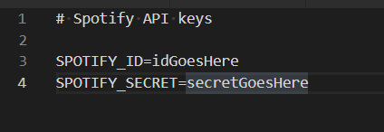
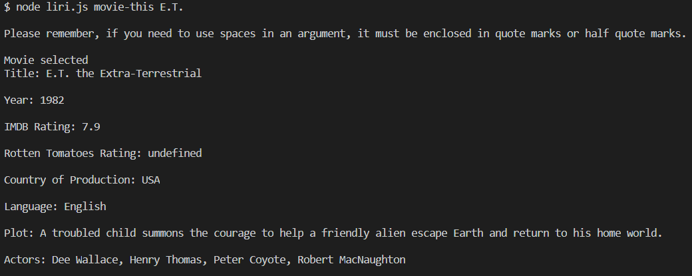
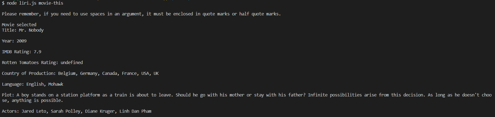
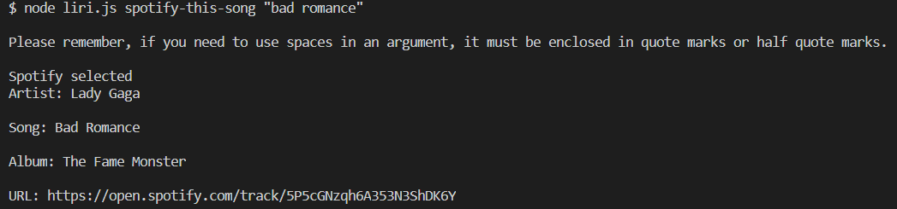
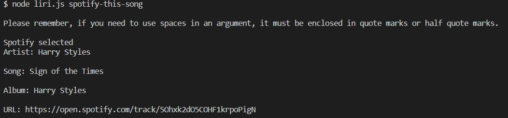
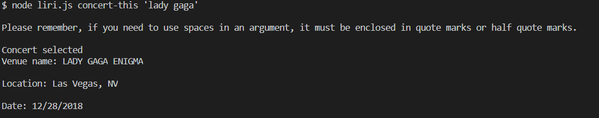
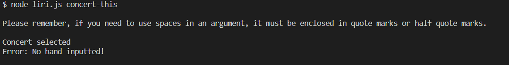
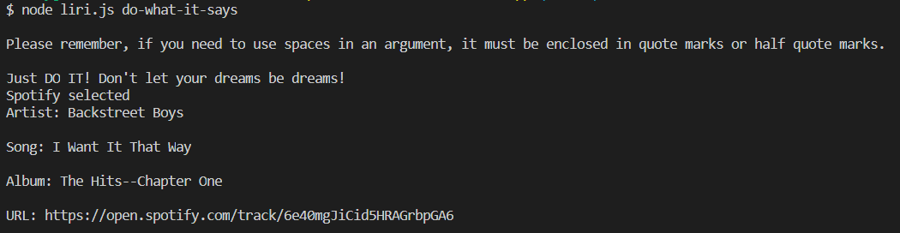

~~Shouldn't this really be called TIRI, Textual Interpretation and Recognition Interface?~~

# LIRI, the Language Interpretation and Recognition Interface.
### This is a client-side app designed to take one to two inputs and process them appropriately, using the specific first term to decide how to handle it.  The options for that term are "spotify-this-song", "movie-this", "concert-this", and "do-what-it-says".  The Spotify API is used to search for information on a song, and will default to a pre-determined song if none is provided.  The OMDB API is used to search for information on a movie, also has a default, and (as it is not as obvious from the API name) is used with the "movie-this" option.  The Bands-In-Town API handles the "concert-this" option, and searches info on the next concert for a band, but does not come with a default value.

### This project was made to test the use of node to handle user input without the need for browsers.

# Some Assembly Required

## Please, please just use npm i before using this application.  You already know this is necessary, so don't blame me if you don't generate a node_modules folder before runtime

## Please note that use of this product requires the generation of your own .env file in the folder, which contains an API key and secret for Spotify.  For information on format, please refer to the sample image: 

## How to Use:

1.  Enter "node liri.js option [search term]", without quotes or brackets and replacing the option with the desired option.
  1. If you want to search for something, place that term last, in quotes, instead of a blank where [search term] is located.
2. The result is returned to you.

The result should look like one of these:        

or [error out](./assets/images/liriError.png)
